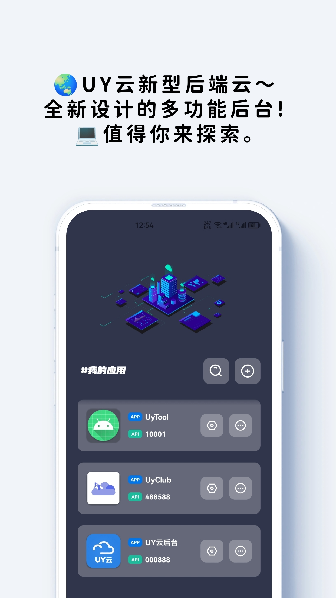
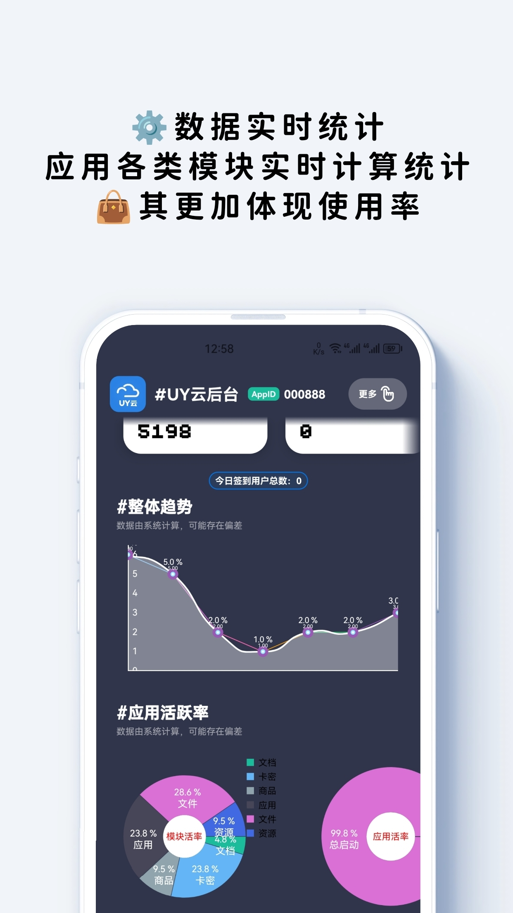
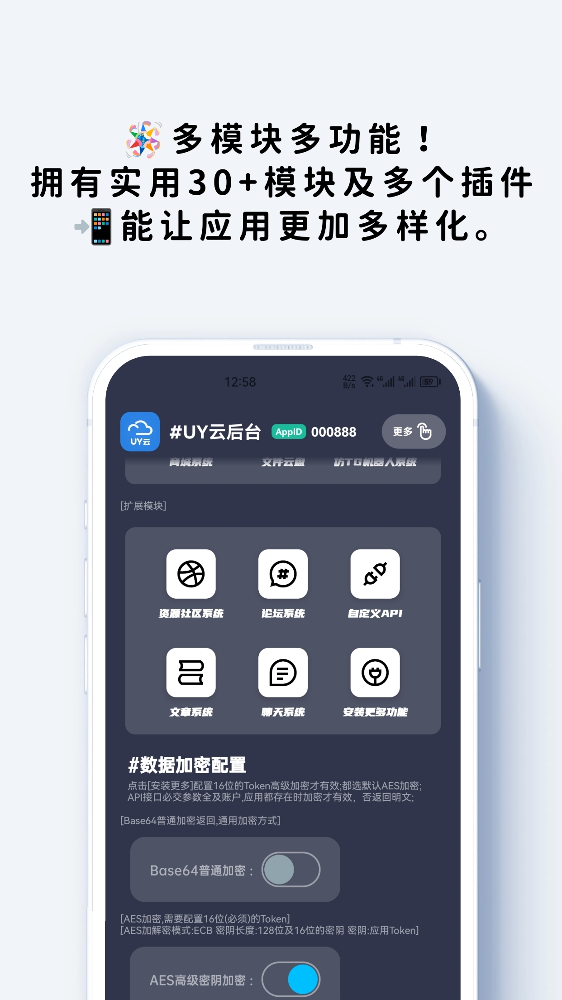
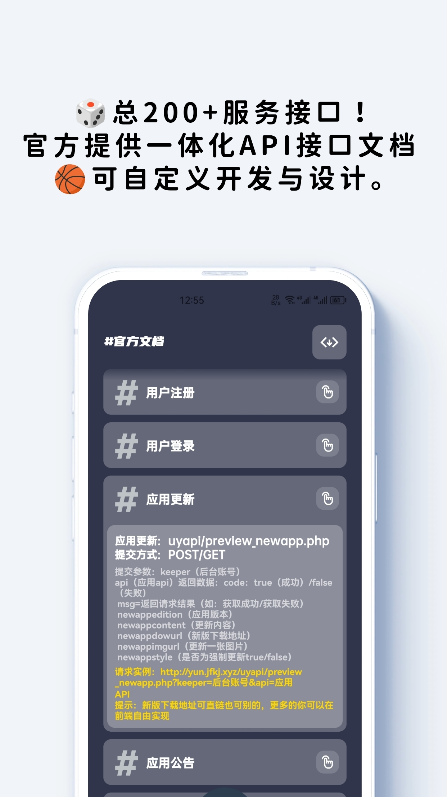
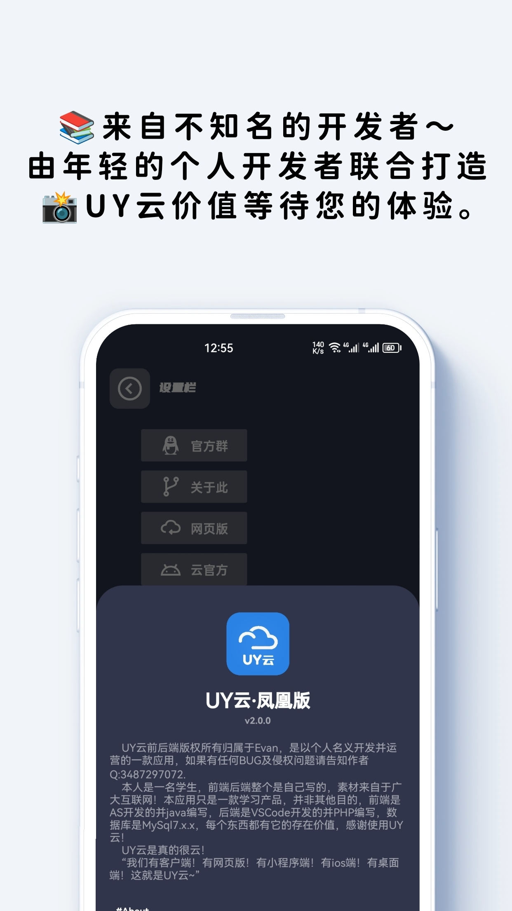
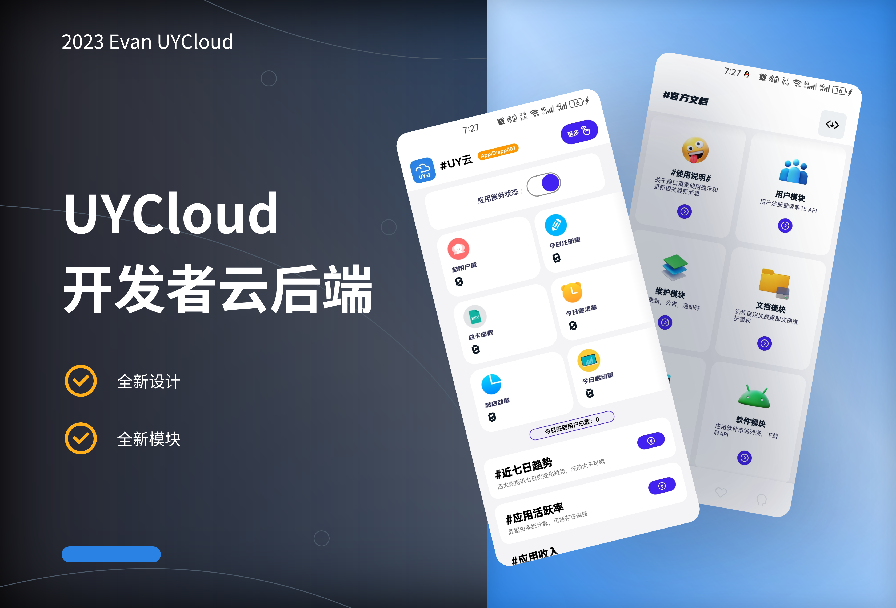

##  :earth_americas: UY云
  UY云是主要面向个人开发者的新型第三方多功能稳定的后台管理系统。拥有30+功能，100+API，10+实例。   
##  :santa: 官方网址
##### 官网
- https://uyclouds.com 
- https://yun.jfkj.xyz  
##### 作者
- https://jfkj.xyz
##  :necktie: 应用简介
  UY云是一款新的应用后台管理系统，主要是用来管理应用，小程序，网站等，可以对多端进行一体化管理和维护。UY云可以理解为是个第三方应用管理系统，开发者仅需关注前端开发业务，无需对服务器，域名以及后端开发等等所费用担忧。目前已开发安卓及网页版，并且一直对进行维护和更新。UY云中可自定义管理应用，我们提供了用户管理模块，应用维护模块，远程文档模块，远程卡密模块等等多个实用及常用模块功能，使对开发者提供更广泛和更实用的功能。我们今后会尽力优化和更新应用功能，提供更高效，更安全，更舒服的后端云服务。
##  :rotating_light: 主要服务
- 用户管理模块
- 应用维护模块
- 远程通知模块
- 远程HTML文档模块
- 远程TEXT文档模块
- 商城服务模块
- 软件市场服务模块
- 影视服务模块
- 应用托管模块
- 远程卡密模块
- 云盘服务模块
- 自动恢复模块
- 资源社区模块
- 多功能论坛模块
- 自定义API模块
- 蓝奏云模块   
  ...  
总之，UY云多功能后台管理系统（称 UY云 及 UYCloud ）是专为个人开发者设计的一款高效、成本低廉的后台管理解决方案。该系统旨在帮助个人开发者摆脱繁琐的后端开发和服务器部署，提供便捷的方式来管理他们的软件应用。通过UY云系统，个人开发者可以轻松地将自己的应用与后台管理系统对接，并通过API接口进行灵活的管理。系统提供了丰富的功能模块，覆盖了个人开发者常用的各种需求。从资源的获取、更新和提交，到报文转换、数据远程处理和返回，再到安全验证、卡片验证、用户验证、使用日志和账户服务等通用服务模块，一应俱全。此外，UY云系统还支持与第三方系统的接口对接，实现与自助后台服务器的交互，以获取用户的交互数据。开发者可以通过指定的API向服务器发起请求，并高效地获取所需的数据，满足不同场景下的管理需求。UY云多功能后台管理系统为个人开发者提供了一个完善的解决方案，使他们能够简化软件管理流程，降低费用和成本。通过该系统，个人开发者可以更专注于应用开发，无需过多关注后端和服务器细节，从而提升工作效率并更好地管理自己的应用。
##  :helicopter: 应用预览

